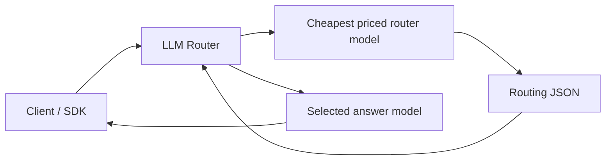

# LLM Router

[](https://github.com/study8677/llm-router/actions/workflows/ci.yml)
[](LICENSE)


把一个普通中转站升级成会自动选模型的本地 AI Gateway。

你已经有了一个 OpenAI-compatible 中转站 `base_url` 和 API Key，但每次都要手动切模型：简单问题用强模型浪费钱，复杂 coding 用弱模型又容易翻车。LLM Router 在你的客户端和中转站之间加一层轻量路由，让客户端只需要填 `auto`、`auto-coding` 或 `auto-longtext`。

## 为什么值得用

- **少切模型**：一个 `auto` 覆盖简单问答、长文本、代码、复杂规划。
- **省成本**：路由模型自动选择上游中价格已知且最便宜的模型，只做决策不回答。
- **复杂任务不省错钱**：困难 coding、架构规划、安全 review、生产事故分析会倾向最强模型。
- **兼容现有客户端**：暴露 OpenAI-compatible `/v1/chat/completions`。
- **支持流式**：`stream: true` 会代理上游 SSE。
- **透明可观测**：响应 header 和结构化日志会记录原始模型、目标模型、路由过程和 fallback。

## 3 分钟启动

```bash
git clone https://github.com/study8677/llm-router.git
cd llm-router
npm install
cp .env.example .env
```

编辑 `.env`：

```bash
UPSTREAM_BASE_URL=https://your-relay.example.com
UPSTREAM_API_KEY=sk-your-upstream-key
```

启动：

```bash
npm run build
npm start
```

客户端配置：

```bash
base_url=http://127.0.0.1:8787/v1
api_key=任意值
model=auto
```

如果你设置了 `ROUTER_API_KEY`，客户端的 `api_key` 要填这个本地代理 Key。

## 虚拟模型

| 模型名 | 适合场景 | 典型选择 |
| --- | --- | --- |
| `auto` | 通用任务、问答、翻译、改写、推理 | 简单任务走低成本模型，困难推理走强模型 |
| `auto-coding` | 代码生成、debug、架构设计、repo 级规划 | 简单代码走 coding specialist，困难工程任务走最强模型 |
| `auto-longtext` | 长文本总结、抽取、合同/文档分析 | 简单抽取走低成本模型，复杂长文本推理走强模型 |

也可以继续传真实模型 ID。真实模型会直接转发，不经过路由模型。

## 架构



路由是两阶段：

1. 便宜路由模型读取原始请求、候选模型、价格、能力提示和当前虚拟模式。
2. 回答模型独立处理原始请求。即使路由模型和回答模型是同一个 ID，也会调用第二次，不复用路由内容。

更多细节见 [Architecture](docs/ARCHITECTURE.md)。

## API

健康检查：

```bash
curl http://localhost:8787/health
```

模型列表：

```bash
curl http://localhost:8787/v1/models
```

自动路由：

```bash
curl http://localhost:8787/v1/chat/completions \
  -H 'content-type: application/json' \
  -d '{
    "model": "auto",
    "messages": [{"role": "user", "content": "Explain binary search in one paragraph."}]
  }'
```

流式自动路由：

```bash
curl -N http://localhost:8787/v1/chat/completions \
  -H 'content-type: application/json' \
  -d '{
    "model": "auto-coding",
    "stream": true,
    "messages": [{"role": "user", "content": "Write a TypeScript debounce function."}]
  }'
```

响应 header：

- `x-llm-router-request-id`
- `x-llm-router-original-model`
- `x-llm-router-target-model`

## 能力矩阵

| 能力 | 状态 |
| --- | --- |
| `POST /v1/chat/completions` | 支持 |
| `GET /v1/models` | 支持 |
| `GET /health` | 支持 |
| Chat Completions streaming | 支持 |
| tools / function calling 透传 | 支持 |
| 多模态 Chat Completions 透传 | 支持 |
| auto fallback | 支持 |
| `/v1/embeddings` | 计划中 |
| `/v1/responses` | 计划中 |
| Anthropic Messages API | 计划中 |

## 路由策略

当前 GPT 风格模型池的默认倾向：

| 任务 | 路由倾向 |
| --- | --- |
| 简单聊天、改写、翻译、短问答 | `gpt-5.4-mini` 或其他低成本可用模型 |
| 简单代码、小段代码生成、语法帮助、直接 bug 修复 | `gpt-5.3-codex` |
| 困难 coding、架构规划、repo 级迁移、复杂 debug、PR/安全 review | 最强前沿模型，例如 `gpt-5.5`，并使用 `xhigh` |
| 简单长文本抽取或总结 | 低成本且长上下文可用的模型 |
| 复杂长文本推理、高风险分析 | 最强前沿模型，并使用 `high` 或 `xhigh` |

自动路由遇到 timeout、network error、`429`、`5xx` 会按配置重新路由并重试。流式响应只有在上游还没吐出 chunk 前才能 fallback；一旦已经发给客户端，就不能安全换模型。

## 多模态和工具调用

- `tools`、`tool_choice`、`parallel_tool_calls`、旧版 `functions`、`function_call` 会透传给最终模型。
- 工具调用和多模态请求会在内部路由 payload 里带上 `required_capabilities`。
- 多模态最终请求会原样转发。
- 内部路由请求会把 base64 图片、超长 base64 字符串和超长 URL 替换成元数据，避免路由模型上下文被图片 payload 撑爆。

## 像 ccswitch 一样简单吗？

底层路由能力已经具备，当前使用步骤是：

1. 填 `.env`
2. 启动服务
3. 把客户端的 `base_url` 改成 `http://127.0.0.1:8787/v1`
4. 把模型名改成 `auto`、`auto-coding` 或 `auto-longtext`

要做到 ccswitch 那种一键体验，下一步会做 CLI：

```bash
llm-router init
llm-router start
llm-router status
llm-router stop
```

路线图见 [Roadmap](docs/ROADMAP.md)。

## Docker

```bash
cp .env.example .env
docker compose up --build
```

## 文档

- [Configuration](docs/CONFIGURATION.md)
- [Routing Behavior](docs/ROUTING_BEHAVIOR.md)
- [Client Examples](docs/CLIENTS.md)
- [Architecture](docs/ARCHITECTURE.md)
- [Operations](docs/OPERATIONS.md)
- [FAQ](docs/FAQ.md)
- [Roadmap](docs/ROADMAP.md)
- [Contributing](CONTRIBUTING.md)
- [Security](SECURITY.md)

## 开发

```bash
npm install
npm run build
npm test
```

真实上游路由评估：

```bash
npm run test:live-routing
```

`test:live-routing` 会读取本地 `.env` 并调用真实上游。

## 安全

- 不要提交 `.env`。
- 如果服务不是只监听本机可信客户端，请设置 `ROUTER_API_KEY`。
- 不要把本服务无认证暴露到公网。
- 安全问题请使用 GitHub private vulnerability reporting。

## License

[MIT](LICENSE)
