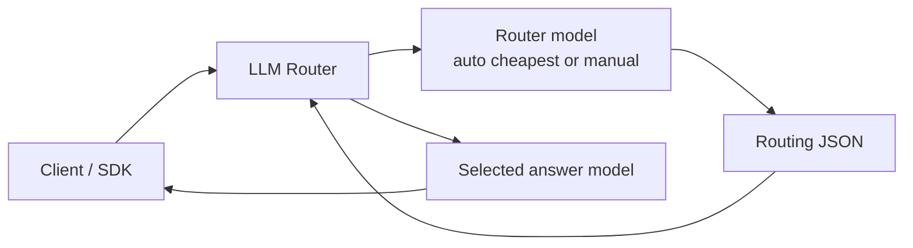

<div align="center">

# LLM Router

**把普通 OpenAI-compatible 中转站，升级成会自动选模型的本地 AI Gateway。**

[](https://github.com/study8677/llm-router/actions/workflows/ci.yml)
[](LICENSE)


`auto` / `auto-coding` / `auto-longtext`

[快速开始](#3-分钟启动) · [虚拟模型](#虚拟模型) · [架构](#架构) · [路由策略](#路由策略) · [Docker](#docker) · [文档](#文档)

</div>

LLM Router 运行在你的客户端和上游中转站之间。客户端继续使用熟悉的 `/v1/chat/completions`，只需要把模型名写成 `auto`、`auto-coding` 或 `auto-longtext`，路由器会根据请求内容、模型价格、能力约束和失败重试策略，选择更合适的真实模型。

```text
Client / SDK  ->  LLM Router  ->  your existing OpenAI-compatible relay
model=auto        local policy      selected real model
```

适合已经有 `base_url` 和 API Key，但不想每次手动切模型的人：简单任务尽量便宜，复杂 coding、长文本推理、架构规划和安全 review 不为了省钱牺牲质量。

## 你会得到什么

- **一个统一入口**：客户端只配一次 `base_url=http://127.0.0.1:8787/v1`。
- **三个虚拟模型**：`auto`、`auto-coding`、`auto-longtext` 覆盖日常、工程和长文本场景。
- **OpenAI 兼容**：支持 Chat Completions、SSE streaming、tools/function calling 和多模态透传。
- **成本感知路由**：路由模型只负责决策，回答仍由被选中的真实模型完成。
- **可观测 fallback**：响应 header 和结构化日志记录原始模型、目标模型、路由过程和重试。

## 3 分钟启动

```bash
git clone https://github.com/study8677/llm-router.git
cd llm-router
npm install
cp .env.example .env
```

编辑 `.env`，填入你已有的上游中转站：

```bash
UPSTREAM_BASE_URL=https://your-relay.example.com
UPSTREAM_API_KEY=sk-your-upstream-key
```

启动服务：

```bash
npm run build
npm start
```

打开本地配置页：

```text
http://127.0.0.1:8787/admin
```

这里可以查看上游模型、当前生效的路由模型，并把 `auto` 使用的路由模型从“自动选择最便宜已知价格模型”改成“手动指定某个模型”。配置会保存到 `.llm-router.local.json`。

客户端改成：

```bash
base_url=http://127.0.0.1:8787/v1
api_key=任意值
model=auto
```

如果设置了 `ROUTER_API_KEY`，客户端的 `api_key` 需要填写这个本地代理 Key。

## 虚拟模型

### `auto`

通用入口，适合问答、翻译、改写、推理、简单分析和大多数日常请求。简单任务优先低成本模型，困难推理会升到更强模型。

### `auto-coding`

工程入口，适合代码生成、debug、架构设计、repo 级规划、PR review 和安全分析。简单代码任务可以走 coding specialist，复杂工程任务会倾向最强模型。

### `auto-longtext`

长文本入口，适合总结、抽取、合同/文档分析、长上下文推理。简单抽取优先低成本长上下文模型，复杂分析会选择更强推理模型。

你也可以继续传真实模型 ID。真实模型会直接转发，不经过路由模型。

## 架构



路由是两阶段完成的：

1. 路由模型读取原始请求、候选模型、价格、能力提示和当前虚拟模式，输出结构化路由决策。默认使用最便宜且价格已知的模型，也可以在本地 Admin 页手动指定。
2. 回答模型独立处理原始请求。即使路由模型和回答模型是同一个 ID，也会再调用一次，不复用路由内容。

遇到 timeout、network error、`429`、`5xx` 时，自动路由会按配置重新路由并重试。流式响应只有在上游还没吐出 chunk 前才能 fallback；一旦已经发给客户端，就不能安全换模型。

更多细节见 [Architecture](docs/ARCHITECTURE.md) 和 [Routing Behavior](docs/ROUTING_BEHAVIOR.md)。

## API

健康检查：

```bash
curl http://localhost:8787/health
```

模型列表：

```bash
curl http://localhost:8787/v1/models
```

自动路由：

```bash
curl http://localhost:8787/v1/chat/completions \
  -H 'content-type: application/json' \
  -d '{
    "model": "auto",
    "messages": [{"role": "user", "content": "Explain binary search in one paragraph."}]
  }'
```

流式自动路由：

```bash
curl -N http://localhost:8787/v1/chat/completions \
  -H 'content-type: application/json' \
  -d '{
    "model": "auto-coding",
    "stream": true,
    "messages": [{"role": "user", "content": "Write a TypeScript debounce function."}]
  }'
```

响应 header 会暴露关键路由信息：

```text
x-llm-router-request-id
x-llm-router-original-model
x-llm-router-target-model
```

## 能力矩阵

| 类型 | 当前支持 |
| --- | --- |
| OpenAI-compatible API | `POST /v1/chat/completions`、`GET /v1/models`、`GET /health` |
| Chat Completions | 普通响应、SSE streaming、auto fallback |
| 请求透传 | tools / function calling、多模态 Chat Completions |
| 计划中 | `/v1/embeddings`、`/v1/responses`、Anthropic Messages API |

## 路由策略

默认策略偏向“简单任务省成本，复杂任务保质量”：

- 简单聊天、改写、翻译、短问答：优先 `gpt-5.4-mini` 或其他低成本可用模型。
- 简单代码、小段代码生成、语法帮助、直接 bug 修复：倾向 `gpt-5.3-codex`。
- 困难 coding、架构规划、repo 级迁移、复杂 debug、PR/安全 review：倾向最强前沿模型，例如 `gpt-5.5`，并使用 `xhigh`。
- 简单长文本抽取或总结：选择低成本且长上下文可用的模型。
- 复杂长文本推理、高风险分析：选择最强前沿模型，并使用 `high` 或 `xhigh`。

模型池、价格、能力标签和重试行为都可以通过配置调整。配置入口见 [Configuration](docs/CONFIGURATION.md)。

## 本地 Admin

访问 `http://127.0.0.1:8787/admin` 可以配置 auto 路由第一跳使用的“路由模型”：

- **自动选择**：默认模式，从上游模型列表中选择价格已知且最便宜的模型做路由。
- **手动指定**：固定使用你选择的某个上游模型做路由，适合你希望路由判断也更聪明的场景。
- 如果设置了 `ROUTER_API_KEY`，页面会要求输入这个本地 Key 才能读取或保存配置。

这只影响路由判断模型，不会把它当成最终回答复用。最终回答仍然由路由 JSON 选出的目标模型单独调用。

## 多模态和工具调用

LLM Router 会尽量保持最终请求和原始客户端请求一致：

- `tools`、`tool_choice`、`parallel_tool_calls`、旧版 `functions`、`function_call` 会透传给最终模型。
- 工具调用和多模态请求会在内部路由 payload 里带上 `required_capabilities`。
- 多模态最终请求会原样转发。
- 内部路由请求会把 base64 图片、超长 base64 字符串和超长 URL 替换成元数据，避免路由模型上下文被图片 payload 撑爆。

## Docker

```bash
cp .env.example .env
docker compose up --build
```

Docker 和生产运行建议见 [Operations](docs/OPERATIONS.md)。

## 文档

- [Configuration](docs/CONFIGURATION.md)：环境变量、模型池、fallback 和认证配置。
- [Routing Behavior](docs/ROUTING_BEHAVIOR.md)：路由输入、决策、失败重试和边界行为。
- [Client Examples](docs/CLIENTS.md)：常见客户端接入方式。
- [Architecture](docs/ARCHITECTURE.md)：两阶段路由和内部数据流。
- [Operations](docs/OPERATIONS.md)：部署、日志、监控和运行建议。
- [FAQ](docs/FAQ.md)：常见问题。
- [Roadmap](docs/ROADMAP.md)：后续计划，包括更接近 ccswitch 的 CLI 体验。
- [Contributing](CONTRIBUTING.md)：贡献指南。
- [Security](SECURITY.md)：安全策略。

## 开发

```bash
npm install
npm run build
npm test
```

真实上游路由评估：

```bash
npm run test:live-routing
```

`test:live-routing` 会读取本地 `.env` 并调用真实上游。

## 安全

默认建议把 LLM Router 作为本机或内网服务使用：

- 不要提交 `.env`。
- 如果服务不是只监听本机可信客户端，请设置 `ROUTER_API_KEY`。
- 不要把本服务无认证暴露到公网。
- 安全问题请使用 GitHub private vulnerability reporting。

## License

[MIT](LICENSE)
