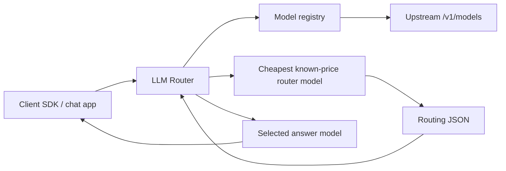

# Architecture

LLM Router is a two-stage OpenAI-compatible proxy.

## Request flow

1. The client calls `POST /v1/chat/completions`.
2. If `model` is a real upstream model ID, the request is forwarded directly.
3. If `model` is `auto`, `auto-coding`, or `auto-longtext`, the router builds an internal routing request.
4. The routing request is sent to the cheapest model with known pricing.
5. The router validates the returned JSON.
6. The original request is forwarded to the selected target model with only `model` replaced.

For streaming requests, the route decision is still non-streaming. After the target is selected, the selected upstream SSE response is proxied to the client.

## Routing invariants

- The router model never answers the user.
- The answer model call is always a separate call.
- Manual model IDs bypass routing.
- Unknown-price models may answer, but cannot be selected as the cheapest router model.
- Invalid `target_model` values are rejected.
- API keys are sanitized from error messages.

## Fallback

Auto fallback is enabled only for virtual models.

Retryable failures:

- timeout
- network error
- `429`
- `5xx`

The failed target is added to `excluded_models`, then the router model is called again.

For streaming, fallback can only happen before chunks are sent to the client.

## Multimodal and tools

The final answer request keeps the original payload.

The internal route request is optimized for routing:

- base64 data URLs are replaced with metadata
- very long base64-like strings are omitted
- very long URLs are truncated
- `tools`, `tool_choice`, `functions`, and `function_call` are passed as routing context
- `required_capabilities` is added for vision and tool requests
